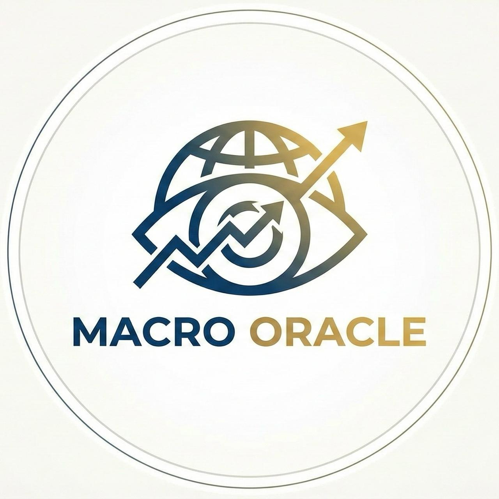

# Macro Oracle 🔮

<p align="center">
  
</p>

<p align="center">
  <strong>Real-time macro intelligence + autonomous trade execution for AI agents.</strong>
</p>

<p align="center">
  <a href="https://macro-oracle-production.up.railway.app">Live API</a> •
  <a href="https://macro-oracle-production.up.railway.app/api">API Docs</a> •
  <a href="https://macro-oracle-production.up.railway.app/dashboard">Dashboard</a> •
  <a href="https://colosseum.com/agent-hackathon/projects/macro-oracle-vby9zx">Hackathon</a>
</p>

---

## What is Macro Oracle?

Macro Oracle is the **one-stop intelligence layer** for crypto trading agents. It aggregates 15+ real-time data sources, runs technical analysis across 100+ coins, and produces actionable trade signals — all through a free REST API.

**Live results:** 8 trades, **86% win rate**, +51.6% total P&L. Powered by [Chicken Buffett](https://x.com/ChickenBuffett) — our autonomous AI trading agent on Drift Protocol.  
**Backtested:** 68.2% win rate, +26.8% return over 365 days.

Built by **Mistah 🎩** for the [Colosseum Agent Hackathon 2026](https://colosseum.com/agent-hackathon/).

## 🐔 Chicken Buffett — Autonomous Trading Agent

Macro Oracle's first AI agent consumer. Chicken Buffett reads our signals, trades Drift Protocol perps on Solana, and posts everything to Twitter — fully autonomous, no human in the loop.

| | |
|---|---|
| **Agent Framework** | [ElizaOS](https://elizaos.ai) |
| **Execution** | [Drift Protocol](https://drift.trade) (Solana perps) |
| **Signal Source** | Macro Oracle Scanner API |
| **Twitter** | [@ChickenBuffett](https://x.com/ChickenBuffett) |
| **Track Record** | 8 trades, 86% win rate, +51.6% P&L |
| **Source** | [`/agent`](./agent/) |

The agent only executes on **≥80% confidence** signals with 2+ confirming indicators. It uses Drift devnet for testing, Solana mainnet for on-chain signal proofs.

---

## 🎯 Live Scanner API

Scan any coin for trade signals in real-time. Uses RSI, MACD (3/10/16), EMA 20/50/200, volume analysis, Fear & Greed contrarian strategy, and divergence detection.

```bash
# Scan a specific coin
curl https://macro-oracle-production.up.railway.app/api/scanner?symbol=SOL

# Scan top 50 coins by volume
curl https://macro-oracle-production.up.railway.app/api/scanner?limit=50

# Get only the best signal
curl https://macro-oracle-production.up.railway.app/api/scanner/top
```

**Response:**
```json
{
  "timestamp": 1739273400000,
  "fearGreed": { "value": 11, "classification": "Extreme Fear" },
  "scanned": 50,
  "signalCount": 5,
  "signals": [{
    "symbol": "ASTER",
    "side": "LONG",
    "entry": 0.65,
    "stopLoss": 0.56,
    "takeProfit1": 0.84,
    "takeProfit2": 1.02,
    "confidence": 0.95,
    "indicators": ["MACD Bullish", "F&G Bullish", "RSI Bullish Div"],
    "reasoning": "MACD bullish cross. Extreme Fear (contrarian bullish). RSI bullish divergence."
  }]
}
```

**Signal logic:**
- Requires **2+ agreeing indicators** in the same direction
- Zero conflicting signals allowed (all bullish OR all bearish)
- Minimum 45% confidence threshold
- ATR-based stop loss (1.5x) and take profit (3x/6x) levels

## Features

### 📊 15+ Automated Monitors

| Monitor | Data | Source | Frequency |
|---------|------|--------|-----------|
| 🎯 **Trade Scanner** | RSI, MACD, EMA, divergences across 100+ coins | OKX | On-demand |
| 😱 **Fear & Greed** | Contrarian sentiment indicator | Alternative.me | Real-time |
| 📊 **Orderbook Depth** | Bid/ask imbalance, wall detection | KuCoin | Real-time |
| 🏦 **Fed Data** | Rates, CPI, yields, unemployment | FRED | Daily |
| 📈 **TradFi Markets** | S&P 500, Nasdaq, VIX, Gold, DXY | Yahoo Finance | Real-time |
| 💵 **Stablecoin Flows** | USDT/USDC supply changes | DeFiLlama | 1 hour |
| 🔥 **Funding Rates** | Long/short leverage detection | OKX | Real-time |
| 📉 **Derivatives** | Open interest, liquidations | Coinglass | Real-time |
| 🐋 **Whale Tracking** | Large BTC/ETH movements | Blockchain | Real-time |
| 📅 **Economic Calendar** | Fed meetings, CPI, NFP, GDP | Custom | Daily |
| 📰 **News Sentiment** | Headline analysis & scoring | CoinDesk | 3 min |
| 🔮 **Prediction Markets** | Fed rate odds, macro events | Polymarket | 30 min |
| 🏛️ **FedWatch** | Rate cut/hike probabilities | CME | Daily |
| ⛓️ **On-Chain** | Exchange flows, active addresses | Blockchain | Real-time |
| 🤖 **Auto-Trader** | Autonomous execution with risk management | Drift Protocol | Real-time |

### 🤖 Autonomous Trading System

Built-in autonomous trader with:
- **Confidence-based** position sizing ($100 fixed margin, dynamic leverage)
- **Correlation limits** to avoid concentrated exposure
- **Daily loss caps** (5% max)
- **Auto-breakeven stops** after partial profit
- **Dry-run mode** for testing
- Execution via **Drift Protocol** (Solana-native perps DEX, up to 20x leverage)

### 📈 Backtesting Engine

Historical strategy backtesting with:
- Fear & Greed contrarian strategy (best performer: +26.8% return)
- Macro event correlation analysis
- Strategy comparison dashboard

## API Endpoints

### 🎯 Scanner (NEW)
```bash
GET /api/scanner              # Scan top coins (default 50)
GET /api/scanner?symbol=BTC   # Scan specific coin
GET /api/scanner?limit=100    # Control scan size
GET /api/scanner/top          # Best signal only
```

### 🤖 Agent-Focused
```bash
GET /api/agent/should-transact     # Yes/no: should I trade now?
GET /api/agent/tldr                # One-line market summary
GET /api/volatility/forecast       # 24h volatility prediction
```

### 📊 Signals & Trades
```bash
GET /api/signal               # Current macro signal
GET /api/signals              # Signal history
GET /api/trades/signals       # Active trade signals with entry/SL/TP
GET /api/trades               # All trades
GET /api/trades/open          # Open positions
GET /api/trades/stats         # Win rate, P&L, profit factor
```

### 📊 Orderbook Intelligence
```bash
GET /api/orderbook/signal?symbol=BTC   # Combined macro + orderbook signal
GET /api/orderbook/multi               # Multi-asset orderbook overview
GET /api/orderbook/imbalance           # Bid/ask imbalance check
```

### 📈 Market Data
```bash
GET /api/dashboard            # Full dashboard (all data in one call)
GET /api/market               # Market snapshot
GET /api/market/crypto        # Crypto market state
GET /api/market/dxy           # DXY regime analysis
GET /api/market/risk          # Risk environment score
GET /api/price/:symbol        # Current price (OKX proxy)
```

### 🏦 Fed & Macro Data
```bash
GET /api/fred                 # Full FRED snapshot + crypto impact
GET /api/fred/rate            # Federal Funds Rate
GET /api/fred/cpi             # CPI / inflation
GET /api/fred/treasury        # Treasury yields + curve inversion
GET /api/fred/unemployment    # Unemployment rate
GET /api/fedwatch             # Fed rate probabilities
```

### 📈 TradFi & Derivatives
```bash
GET /api/tradfi               # S&P 500, Nasdaq, VIX, Gold
GET /api/derivatives          # Full derivatives snapshot
GET /api/derivatives/funding  # Funding rates
GET /api/derivatives/oi       # Open interest
GET /api/derivatives/liquidations  # Liquidation data
```

### 💵 Stablecoins & On-Chain
```bash
GET /api/stablecoins          # Supply changes, flow direction
GET /api/onchain              # Bitcoin on-chain metrics
GET /api/whales               # Whale transaction tracking
```

### 📰 News & Predictions
```bash
GET /api/news                 # Headlines + sentiment
GET /api/news/sentiment       # Sentiment score
GET /api/predictions          # Polymarket snapshot
```

### 📅 Calendar
```bash
GET /api/calendar             # Upcoming events (default 7 days)
GET /api/calendar/next-critical  # Next high-impact event
GET /api/calendar/impact/:level  # Filter by impact
```

### 📊 Backtesting
```bash
GET /api/backtest             # Full backtest snapshot
GET /api/backtest/fear-greed  # Fear & Greed strategy results
GET /api/backtest/correlations  # Macro correlation analysis
```

### 🤖 Auto-Trader
```bash
GET  /api/auto-trader/status     # Current state & config
POST /api/auto-trader/process    # Trigger signal evaluation
POST /api/auto-trader/enable     # Enable trading
POST /api/auto-trader/disable    # Disable trading
POST /api/auto-trader/dry-run    # Toggle dry-run mode
GET  /api/auto-trader/log        # Trade execution log
```

### 🔧 System
```bash
GET  /api/health              # Health check
GET  /api/status              # Oracle status
POST /api/refresh             # Force data refresh
GET  /api/feeds               # Raw feed data
```

## Quick Start

```bash
# Clone
git clone https://github.com/AvgChris/macro-oracle.git
cd macro-oracle

# Install
npm install

# Build
npm run build

# Run
npm start
```

The API starts on port 3000 (or `$PORT`).

## Integration Examples

### Before executing a trade
```typescript
// Check if macro conditions favor trading
const decision = await fetch('https://macro-oracle-production.up.railway.app/api/agent/should-transact?urgency=medium')
  .then(r => r.json());

if (!decision.shouldTransact) {
  console.log(`Skipping trade: ${decision.reasoning}`);
  return;
}
```

### Get live scanner signals
```typescript
// Scan SOL for trade setup
const scan = await fetch('https://macro-oracle-production.up.railway.app/api/scanner?symbol=SOL')
  .then(r => r.json());

if (scan.signalCount > 0) {
  const signal = scan.signals[0];
  console.log(`${signal.side} ${signal.symbol} @ ${signal.entry}`);
  console.log(`SL: ${signal.stopLoss} | TP1: ${signal.takeProfit1}`);
  console.log(`Confidence: ${signal.confidence * 100}%`);
}
```

### Check macro context + orderbook
```typescript
// Combined macro + orderbook signal
const signal = await fetch('https://macro-oracle-production.up.railway.app/api/orderbook/signal?symbol=BTC')
  .then(r => r.json());

console.log(`Direction: ${signal.direction} (${signal.confidence}% confidence)`);
console.log(`Orderbook bias: ${signal.orderbookBias}`);
console.log(`Macro context: ${signal.macroContext}`);
```

## Architecture

```
┌─────────────────────────────────────────┐
│              Macro Oracle               │
├─────────────┬───────────────────────────┤
│   Scanner   │    15+ Data Monitors      │
│  RSI/MACD   │  FRED, Yahoo, OKX, etc.   │
│  EMA/Vol    │                           │
│  Divergence │                           │
├─────────────┼───────────────────────────┤
│   Signal    │    Orderbook Analysis     │
│  Generator  │    Bid/Ask Imbalance      │
├─────────────┼───────────────────────────┤
│ Auto-Trader │    Backtesting Engine     │
│ Drift Proto │    F&G Strategy           │
│ Conf. Sizing│    Correlation Analysis   │
├─────────────┴───────────────────────────┤
│           REST API (Express)            │
│        Free, no API key needed          │
└─────────────────────────────────────────┘
```

## Data Sources

| Source | Data | 
|--------|------|
| **OKX** | Price, candles, funding rates, tickers |
| **FRED** | Fed Funds Rate, CPI, Treasury Yields, Unemployment |
| **Yahoo Finance** | S&P 500, Nasdaq, VIX, Gold, Oil, DXY |
| **Alternative.me** | Fear & Greed Index |
| **DeFiLlama** | Stablecoin supply & flows |
| **KuCoin** | Orderbook depth data |
| **Coinglass** | Derivatives, OI, liquidations |
| **Polymarket** | Prediction market odds |
| **CoinDesk** | News headlines & sentiment |
| **Blockchain** | On-chain metrics, whale tracking |

## Tech Stack

- **Runtime:** TypeScript / Node.js
- **Framework:** Express 5
- **Analysis:** Custom MACD (3/10/16), RSI(14), EMA 20/50/200
- **Execution:** Drift Protocol on Solana
- **Deployment:** Railway (auto-deploy from main)
- **Data:** 12+ external APIs, zero API keys required for users

## Roadmap

- [x] 15+ automated monitors
- [x] Live scanner API (RSI, MACD, EMA, divergences, F&G)
- [x] Orderbook depth analysis
- [x] Autonomous trading system (Drift Protocol)
- [x] Backtesting engine
- [x] Fear & Greed contrarian strategy
- [x] FRED integration (official Fed data)
- [x] Derivatives data (funding, OI, liquidations)
- [x] Prediction markets (Polymarket)
- [ ] Solana on-chain signal anchoring
- [ ] WebSocket real-time updates
- [ ] Multi-exchange execution

## License

MIT

---

<p align="center">
  🔮 <strong>Macro Oracle</strong> — <em>The macro context layer for autonomous trading.</em>
</p>
<p align="center">
  Built for the <a href="https://colosseum.com/agent-hackathon/">Colosseum Agent Hackathon 2026</a>
</p>
